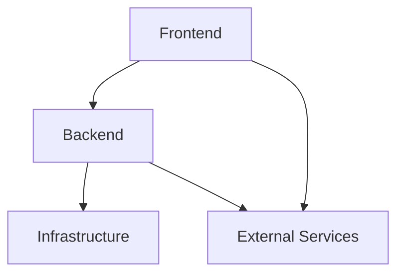
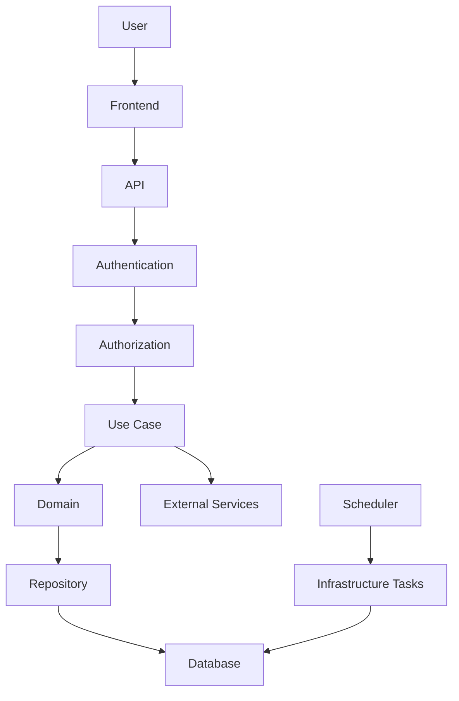
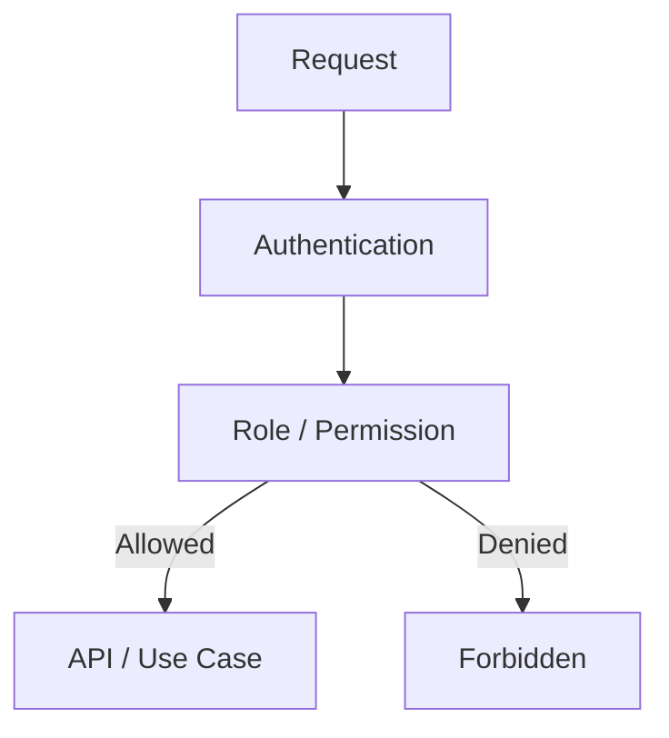
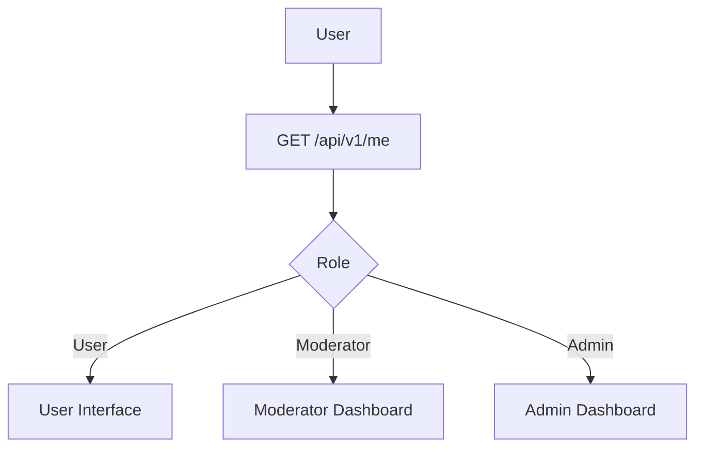
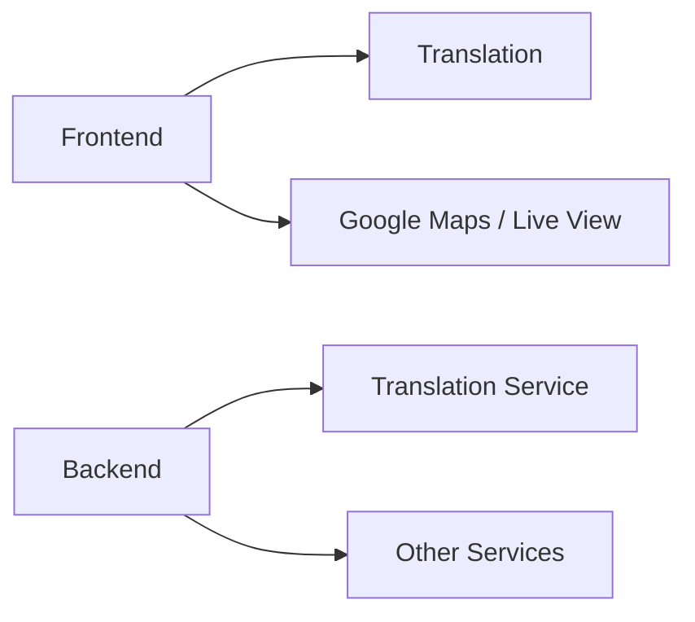
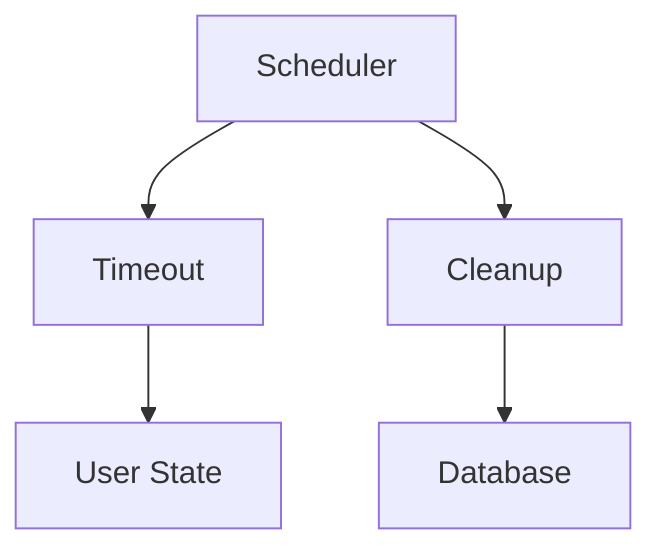

# Architecture


## 1. Tổng quan

Kiến trúc được chia thành ba phần chính:



### Frontend

Phụ trách giao diện, trải nghiệm người dùng và các chức năng tương tác trực tiếp.

### Backend

Phụ trách API, nghiệp vụ, dữ liệu và kiểm tra quyền truy cập.

### Infrastructure

Phụ trách các tác vụ nền và cơ chế vận hành như scheduler, timeout và dọn dữ liệu.

---

# 2. Luồng xử lý



---

# 3. Thực thể

```text
User
Post
Comment
Tag
Report
Role
```

## User

Người dùng có thể:

- Quản lý thông tin cá nhân
- Tạo, sửa và xóa bài viết của bản thân
- Theo dõi người dùng khác
- Chặn người dùng khác
- Lưu và yêu thích nội dung

## Post

Bài viết có thể:

- Chứa nội dung văn bản
- Gắn tag
- Chèn emoji
- Chứa liên kết
- Có bình luận
- Được lưu hoặc yêu thích

## Comment

Bình luận có thể:

- Chứa văn bản
- Chứa liên kết
- Trang trí nội dung
- Tham chiếu hình ảnh bằng URL
- Chứa thông tin vị trí để hiển thị bản đồ / Live View
- Được báo cáo

## Tag

Dùng để phân loại nội dung.

Có giới hạn số lượng tag tùy theo nghiệp vụ.

## Report

Dùng để báo cáo nội dung hoặc hành vi không phù hợp.

Có giới hạn số lần report trong một khoảng thời gian.

## Role

Xác định quyền của người dùng trong hệ thống.

Các nhóm quyền ban đầu:

```text
User
Moderator
Admin
Custom
```

---

# 4. Quyền và phân quyền





---

# 5. API

API sử dụng version:

```text
/api/v1
```

API được chia theo resource thay vì theo page.

---

## 5.1 Me

Thông tin và thao tác của người dùng hiện tại.

```text
GET    /api/v1/me
PATCH  /api/v1/me

GET    /api/v1/me/following
GET    /api/v1/me/followers

GET    /api/v1/me/favorites
POST   /api/v1/me/favorites/:post_id
DELETE /api/v1/me/favorites/:post_id

GET    /api/v1/me/saved
POST   /api/v1/me/saved/:post_id
DELETE /api/v1/me/saved/:post_id
```

---

## 5.2 User

Thông tin công khai và các quan hệ giữa người dùng.

```text
GET    /api/v1/users/:user_id
GET    /api/v1/users/:user_id/posts

POST   /api/v1/users/:user_id/follow
DELETE /api/v1/users/:user_id/follow

POST   /api/v1/users/:user_id/block
DELETE /api/v1/users/:user_id/block
```

---

## 5.3 Post

Resource chính của diễn đàn.

```text
GET    /api/v1/posts
POST   /api/v1/posts

GET    /api/v1/posts/:post_id
PATCH  /api/v1/posts/:post_id
DELETE /api/v1/posts/:post_id
```

Truy vấn sử dụng query parameter:

```text
GET /api/v1/posts?tag=travel
GET /api/v1/posts?sort=newest
GET /api/v1/posts?sort=popular
GET /api/v1/posts?search=tokyo
GET /api/v1/posts?user_id=42
```

---

## 5.4 Comment

Comment thuộc về Post khi tạo hoặc lấy danh sách.

```text
GET    /api/v1/posts/:post_id/comments
POST   /api/v1/posts/:post_id/comments
```

Thao tác trên một comment:

```text
GET    /api/v1/comments/:comment_id
PATCH  /api/v1/comments/:comment_id
DELETE /api/v1/comments/:comment_id
```

---

## 5.5 Tag

```text
GET    /api/v1/tags
GET    /api/v1/tags/:tag_id

POST   /api/v1/tags
DELETE /api/v1/tags/:tag_id
```

---

## 5.6 Reaction

```text
POST   /api/v1/posts/:post_id/reactions
DELETE /api/v1/posts/:post_id/reactions

POST   /api/v1/comments/:comment_id/reactions
DELETE /api/v1/comments/:comment_id/reactions
```

---

## 5.7 Report

Người dùng tạo report thông qua resource mà họ muốn báo cáo.

```text
POST /api/v1/posts/:post_id/reports
POST /api/v1/comments/:comment_id/reports
```

Report được xử lý bởi hệ thống moderation.

---

# 6. Moderation

Moderator xử lý các nghiệp vụ kiểm duyệt.

```text
/api/v1/moderation
```

## Dashboard

```text
GET /api/v1/moderation/dashboard
```

## Report

```text
GET   /api/v1/moderation/reports
GET   /api/v1/moderation/reports/:report_id
PATCH /api/v1/moderation/reports/:report_id
```

## User moderation

```text
POST   /api/v1/moderation/users/:user_id/mute
DELETE /api/v1/moderation/users/:user_id/mute

POST   /api/v1/moderation/users/:user_id/ban
DELETE /api/v1/moderation/users/:user_id/ban
```

---

# 7. Admin

Admin quản lý hệ thống và các quyền cao hơn.

```text
/api/v1/admin
```

## Dashboard

```text
GET /api/v1/admin/dashboard
```

## User / Role

```text
GET    /api/v1/admin/users/:user_id/roles
POST   /api/v1/admin/users/:user_id/roles
DELETE /api/v1/admin/users/:user_id/roles/:role_id
```

## Moderator

```text
POST   /api/v1/admin/users/:user_id/moderator
DELETE /api/v1/admin/users/:user_id/moderator
```

Các API admin chỉ dành cho Admin.

---

# 8. Dashboard

Frontend có thể tách dashboard theo role:

```text
/dashboard
├── moderator
└── admin
```

Trong đó:

```text
/dashboard/moderator
```

phục vụ:

- Xem report
- Xem nội dung cần xử lý
- Mute user
- Ban user
- Theo dõi trạng thái moderation

```text
/dashboard/admin
```

phục vụ:

- Các chức năng moderation
- Quản lý moderator
- Quản lý role
- Quản lý permission
- Quản lý cấu hình hệ thống

Không cần tạo API riêng cho từng page dashboard.

Dashboard chỉ là giao diện sử dụng các API tương ứng.

---

# 9. Frontend

## Home

Hiển thị nội dung tổng quan của hệ thống.

Chức năng:

- Tìm kiếm
- Bài đăng nổi bật
- Bài đăng mới
- Nội dung liên quan
- Danh sách bài viết
- Thông báo hệ thống

Ví dụ API:

```text
GET /api/v1/posts
GET /api/v1/posts?sort=popular
GET /api/v1/posts?sort=newest
GET /api/v1/posts?search=...
```

---

## About

Giới thiệu:

- Thành viên
- Mục đích xây dựng
- Định hướng của diễn đàn

---

## Profile

Hiển thị:

- Thông tin cá nhân
- Bài viết
- Người theo dõi
- Đang theo dõi
- Bài viết yêu thích
- Bài viết đã lưu

API chủ yếu sử dụng:

```text
/api/v1/me
/api/v1/users/:user_id
/api/v1/me/favorites
/api/v1/me/saved
```

---

## Post

Trang bài viết cung cấp:

- Nội dung bài viết
- Tag
- Reaction
- Comment
- Report
- Lưu bài viết
- Thông tin vị trí (thông qua backend)
- Gợi ý ngôn ngữ (thông qua backend)

---

# 10. External Services



Ví dụ:

### Translation

- Dịch bài viết
- Dịch bình luận

### Google Maps

- Hiển thị vị trí
- Hiển thị bản đồ
- Live View nếu dịch vụ hỗ trợ

### Grammar

- Gợi ý ngữ pháp
- Kiểm tra nội dung

Các dịch vụ này có thể được thay thế hoặc bổ sung sau này.

---

# 11. Infrastructure

Infrastructure xử lý các tác vụ chạy nền.



## Timeout

Dùng để tự động cập nhật trạng thái khi mute hoặc các trạng thái có thời hạn kết thúc.

## Cleanup

Dữ liệu cần xóa có thể được đánh dấu thay vì xóa ngay.

```text
Active
  ↓
Deleted
  ↓
Cleanup
  ↓
Permanent Delete
```

---

# 12. Nghiệp vụ chính

Các nghiệp vụ ban đầu:

```text
User
 ├── Create Post
 ├── Edit Own Post
 ├── Delete Own Post
 ├── Follow User
 ├── Block User
 └── Save / Favorite Post

Post
 ├── Tag
 ├── Reaction
 ├── Comment
 └── Report

Moderation
 ├── Review Report
 ├── Mute User
 └── Ban User

Administration
 ├── Manage Moderator
 └── Manage Role / Permission
```

---
