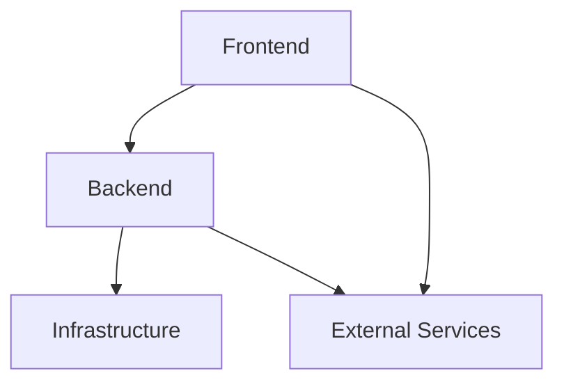
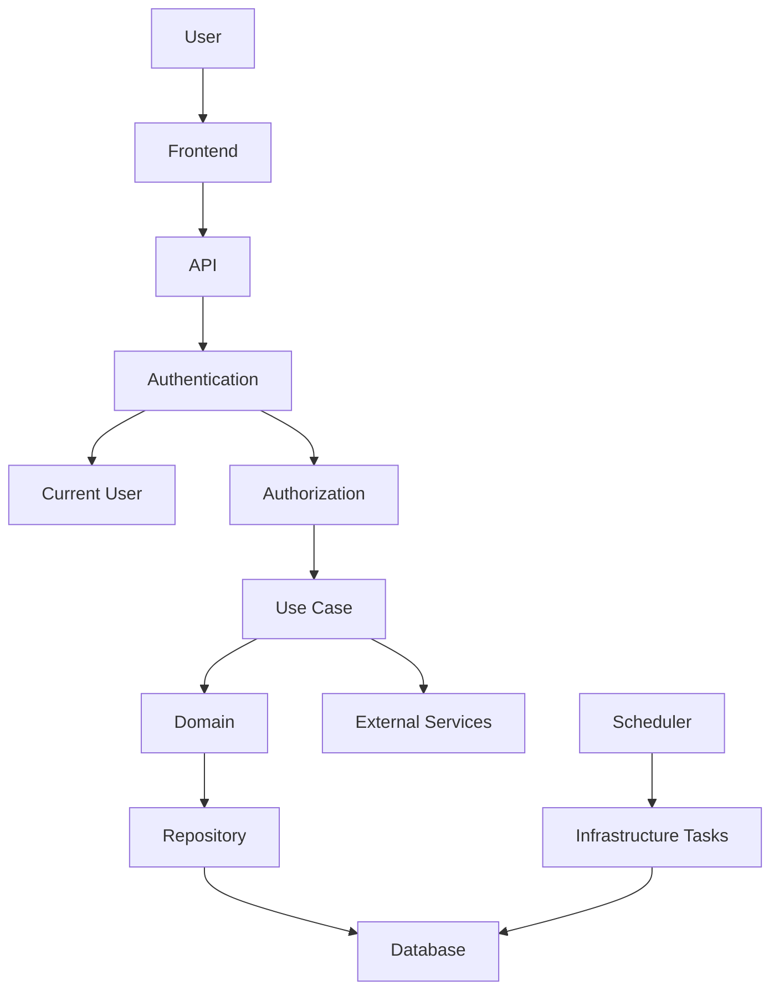
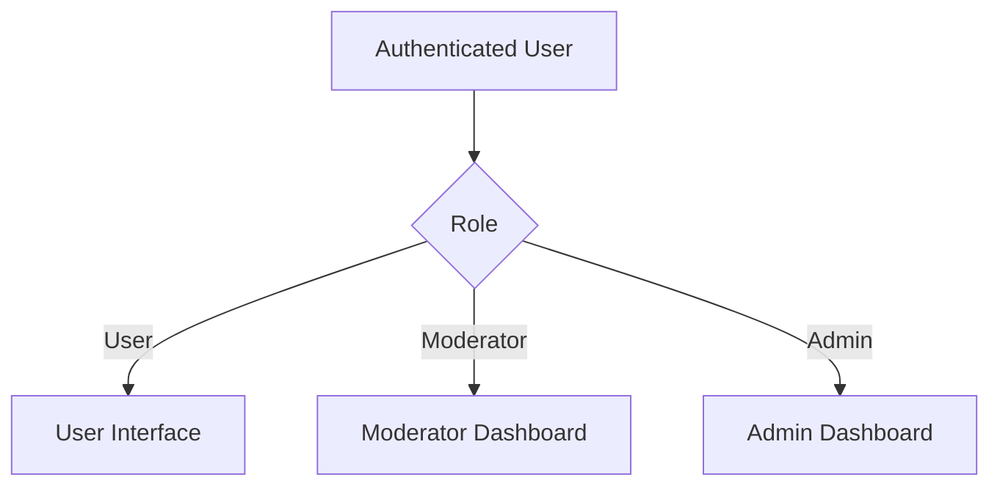
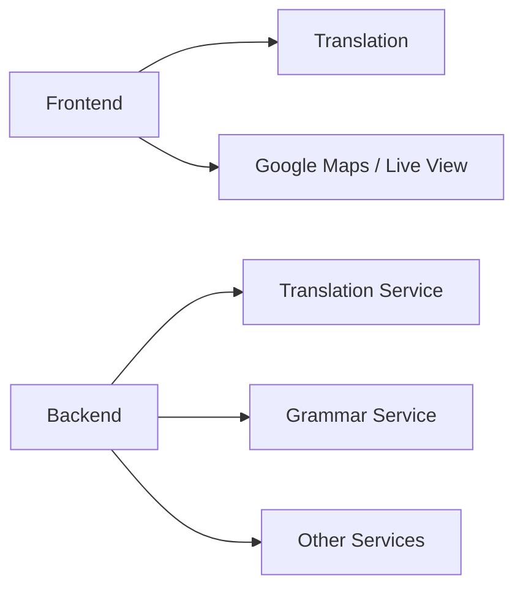
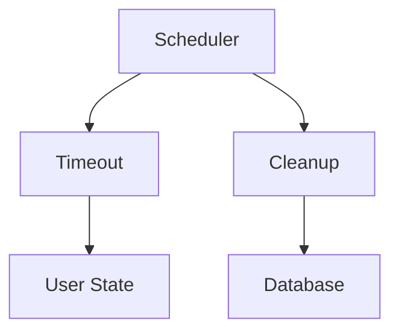
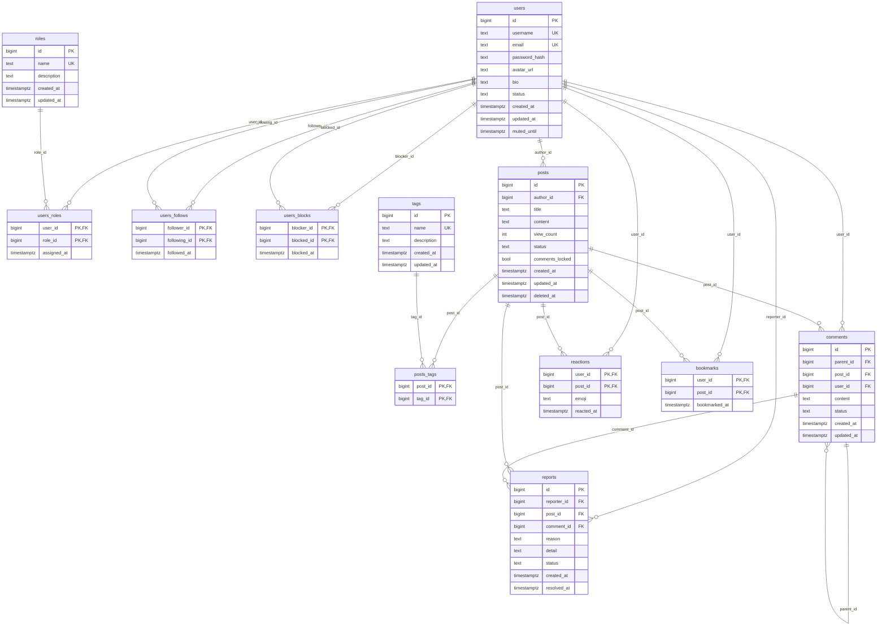
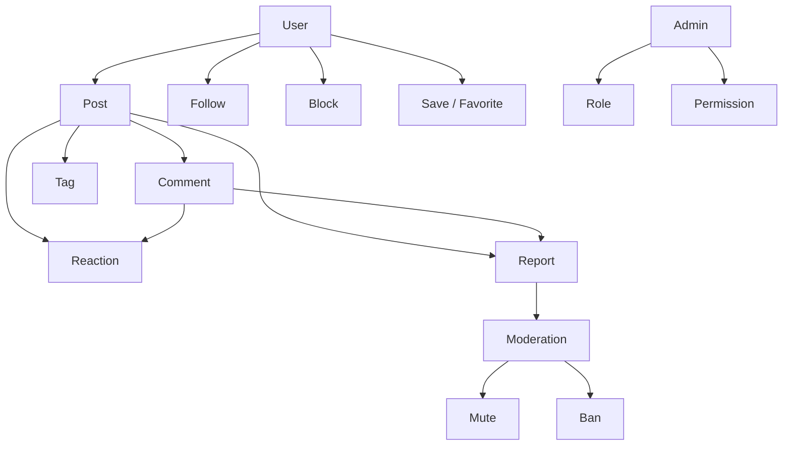

# Architecture


## 1. Tổng quan

Kiến trúc được chia thành ba phần chính:



### Frontend

Phụ trách giao diện, trải nghiệm người dùng và tương tác với hệ thống.

### Backend

Phụ trách API, nghiệp vụ, dữ liệu và kiểm tra quyền truy cập.

### Infrastructure

Phụ trách các tác vụ nền và cơ chế vận hành như scheduler, timeout và dọn dẹp dữ liệu.

### External Services

Cung cấp các chức năng bên ngoài hệ thống như dịch thuật, kiểm tra ngữ pháp và bản đồ.

______________________________________________________________________

# 2. Luồng xử lý



______________________________________________________________________

# 3. Thực thể

Các thực thể chính:

```text
User
Post
Comment
Tag
Reaction
Report
Role
Permission
```

## User

Người dùng có thể:

- Quản lý thông tin cá nhân
- Tạo, sửa và xóa bài viết của bản thân
- Theo dõi người dùng khác
- Chặn người dùng khác
- Lưu và yêu thích nội dung

## Post

Bài viết có thể:

- Chứa nội dung văn bản
- Gắn tag
- Chèn emoji
- Chứa liên kết
- Có bình luận
- Được lưu hoặc yêu thích

## Comment

Bình luận có thể:

- Chứa văn bản
- Chứa liên kết
- Trang trí nội dung
- Tham chiếu hình ảnh bằng URL
- Chứa thông tin vị trí
- Được báo cáo

## Tag

Dùng để phân loại nội dung.

Có giới hạn số lượng tag tùy theo nghiệp vụ.

## Reaction

Biểu thị tương tác của người dùng đối với Post hoặc Comment.

## Report

Dùng để báo cáo nội dung hoặc hành vi không phù hợp.

Có giới hạn số lần report trong một khoảng thời gian.

## Role

Xác định nhóm quyền của người dùng.

Các nhóm quyền ban đầu:

```text
User
Moderator
Admin
Custom
```

## Permission

Xác định một hành động cụ thể mà một Role được phép thực hiện.

______________________________________________________________________

# 4. Quyền và phân quyền



______________________________________________________________________

# 5. API Route

API sử dụng version:

```text
/api/v1
```

API được tổ chức theo entity.

## HTTP Method

```text
GET
    Lấy dữ liệu

POST
    Tạo resource mới

PATCH
    Cập nhật một phần resource

PUT
    Thiết lập hoặc thay thế một trạng thái / quan hệ

DELETE
    Xóa resource hoặc hủy trạng thái / quan hệ
```

______________________________________________________________________

## User

### User

```text
GET /api/v1/users/:user_id
GET /api/v1/users/:user_id/posts

PUT    /api/v1/users/:user_id/follow
DELETE /api/v1/users/:user_id/follow

PUT    /api/v1/users/:user_id/block
DELETE /api/v1/users/:user_id/block
```

### Moderation

Các route dưới đây yêu cầu quyền moderation.

```text
PUT    /api/v1/users/:user_id/mute
DELETE /api/v1/users/:user_id/mute

PUT    /api/v1/users/:user_id/ban
DELETE /api/v1/users/:user_id/ban
```

______________________________________________________________________

## Post

### Collection

```text
GET  /api/v1/posts
POST /api/v1/posts
```

Query parameter:

```text
GET /api/v1/posts?tag=travel
GET /api/v1/posts?sort=newest
GET /api/v1/posts?sort=popular
GET /api/v1/posts?search=tokyo
GET /api/v1/posts?user_id=42
```

### Resource

```text
GET    /api/v1/posts/:post_id
PATCH  /api/v1/posts/:post_id
DELETE /api/v1/posts/:post_id
```

### Bookmark

```text
PUT    /api/v1/posts/:post_id/bookmark
DELETE /api/v1/posts/:post_id/bookmark
```

### Lock comment

```text
PUT    /api/v1/posts/:post_id/lock-comments
DELETE /api/v1/posts/:post_id/lock-comments
```

### Report

```text
POST /api/v1/posts/:post_id/reports
```

______________________________________________________________________

## Comment

### Resource

```text
GET    /api/v1/comments/:comment_id
PATCH  /api/v1/comments/:comment_id
DELETE /api/v1/comments/:comment_id
```

### Reply

```text
GET  /api/v1/comments/:comment_id/replies
POST /api/v1/comments/:comment_id/replies
```

### Reaction

```text
PUT    /api/v1/comments/:comment_id/reaction
DELETE /api/v1/comments/:comment_id/reaction
```

### Report

```text
POST /api/v1/comments/:comment_id/reports
```

______________________________________________________________________

## Tag

```text
GET    /api/v1/tags
POST   /api/v1/tags

GET    /api/v1/tags/:tag_id
PATCH  /api/v1/tags/:tag_id
DELETE /api/v1/tags/:tag_id
```

______________________________________________________________________

## Reaction

### Post

```text
PUT    /api/v1/posts/:post_id/reaction
DELETE /api/v1/posts/:post_id/reaction
```

### Comment

```text
PUT    /api/v1/comments/:comment_id/reaction
DELETE /api/v1/comments/:comment_id/reaction
```

______________________________________________________________________

## Report

### Create

```text
POST /api/v1/posts/:post_id/reports
POST /api/v1/comments/:comment_id/reports
```

### Management

Các route dưới đây yêu cầu quyền moderation.

```text
GET    /api/v1/reports
GET    /api/v1/reports/:report_id
PATCH  /api/v1/reports/:report_id
```

`PATCH` được sử dụng để thay đổi trạng thái xử lý của Report.

______________________________________________________________________

## Role

### User Role

Các thao tác quản lý Role của User yêu cầu quyền Admin.

```text
GET    /api/v1/users/:user_id/roles
PUT    /api/v1/users/:user_id/roles/:role_id
DELETE /api/v1/users/:user_id/roles/:role_id
```

### Role Management

```text
GET    /api/v1/roles
```

______________________________________________________________________

# 6. Dashboard

Dashboard là giao diện phục vụ các Role đặc biệt.

```text
/dashboard
├── moderator
└── admin
```

## Moderator Dashboard

```text
/dashboard/moderator
```

Chức năng:

- Xem và xử lý Report
- Mute User
- Ban User
- Theo dõi trạng thái moderation

API sử dụng các route của:

```text
/api/v1/reports/*
/api/v1/users/:user_id/mute
/api/v1/users/:user_id/ban
```

## Admin Dashboard

Chức năng:

- Quản lý moderation
- Quản lý moderator
- Quản lý Role
- Quản lý cấu hình hệ thống

______________________________________________________________________

# 7. Frontend

## Home

Hiển thị:

- Tìm kiếm
- Bài đăng nổi bật
- Bài đăng mới
- Nội dung liên quan
- Danh sách bài viết
- Thông báo hệ thống

## About

Giới thiệu:

- Thành viên
- Mục đích xây dựng
- Định hướng của diễn đàn

## Profile

Hiển thị:

- Thông tin cá nhân
- Bài viết
- Trang cài đặt cá nhân của tài khoản đang sử dụng
- Người theo dõi
- Đang theo dõi
- Bài viết yêu thích
- Bài viết đã lưu

## Post

Trang Post cung cấp:

- Nội dung bài viết
- Tag
- Reaction
- Comment
- Report
- Lưu bài viết
- Thông tin vị trí
- Gợi ý ngôn ngữ

## Moderator Dashboard

- Danh sách Report
- Chi tiết Report
- Moderation User
- Trạng thái xử lý

## Admin Dashboard

- Quản lý Moderator
- Quản lý Role
- Quản lý Permission
- Quản lý hệ thống

______________________________________________________________________

# 8. External Services



## Translation

- Dịch bài viết
- Dịch bình luận

## Google Maps

- Hiển thị vị trí
- Hiển thị bản đồ
- Live View nếu dịch vụ hỗ trợ

## Grammar

- Gợi ý ngữ pháp
- Kiểm tra nội dung

Các dịch vụ có thể được thay thế hoặc mở rộng sau này.

______________________________________________________________________

# 9. Infrastructure

Infrastructure xử lý các tác vụ chạy nền.



## Timeout

Tự động cập nhật trạng thái khi Mute hoặc Ban hết thời hạn.

## Cleanup

Dọn dẹp dữ liệu đã được Soft Delete sau một khoảng thời gian.

```text
Active
  ↓
Deleted
  ↓
Cleanup
  ↓
Permanent Delete
```



______________________________________________________________________

# 10. Nghiệp vụ chính



Các nghiệp vụ ban đầu:

```text
User
 ├── Create Post
 ├── Edit Own Post
 ├── Delete Own Post
 ├── Follow User
 ├── Block User
 └── Save / Favorite Post

Post
 ├── Tag
 ├── Reaction
 ├── Comment
 └── Report

Comment
 ├── Reaction
 └── Report

Moderation
 ├── Review Report
 ├── Mute User
 └── Ban User

Administration
 ├── Manage Role
 ├── Manage Permission
 └── Manage Moderator
```
