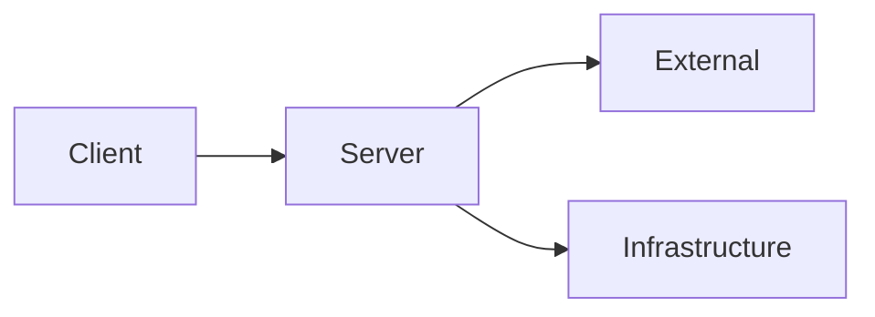
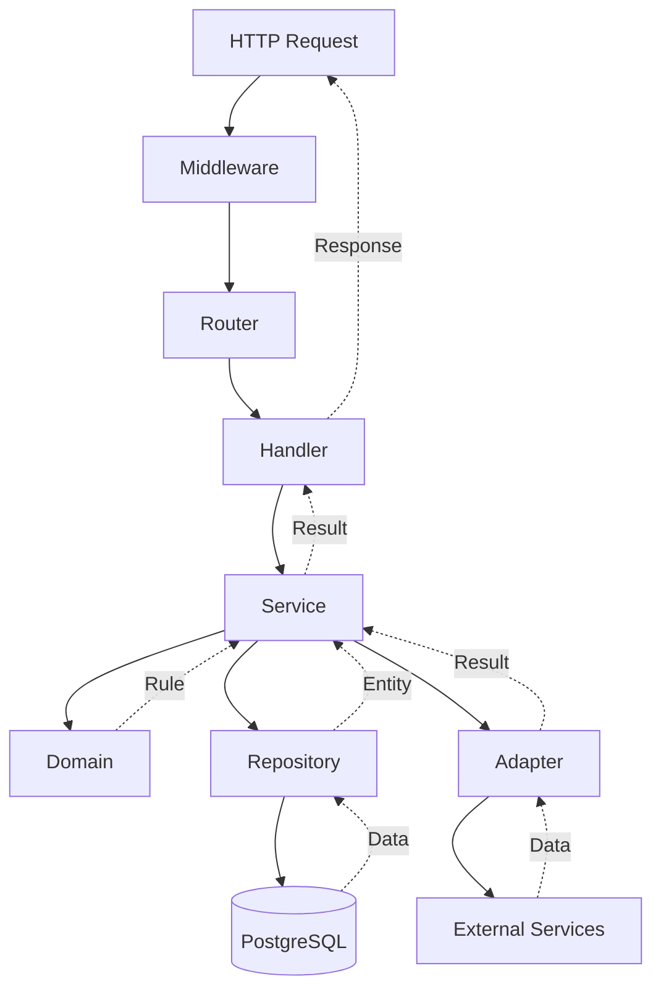

# Các thành phần của Etsubi

Ta có bốn thành phần chính để Etsubi có thể đi vào hoạt động. 

**Trong đó bao gồm:**

- **Client:** Phụ trách giao diện người dùng.

- **Server:** Xử lý các request, nơi quản lý logic của ứng dụng.

- **Infrastruture:** Bao gồm hạ tầng mạng, phần cứng, ... 

- **External:** Gọi các dịch vụ bên ngoài, chẳng hạn như Google Translate, DeepSeek, Map, ...

# Cách ứng dụng hoạt động

Bên trong server gồm nhiều module độc lập. Mỗi module áp dụng DDD ở một mức độ nhất định. kết hợp Adapter Pattern của Hexagonal Architecture để kết nối với các dịch vụ bên ngoài như dịch thuật, phân tích lỗi ngữ pháp, live-view của map.

Các module tuân theo một số quy tắc của Clean Architecture — đặc biệt là quy tắc phụ thuộc một chiều.

