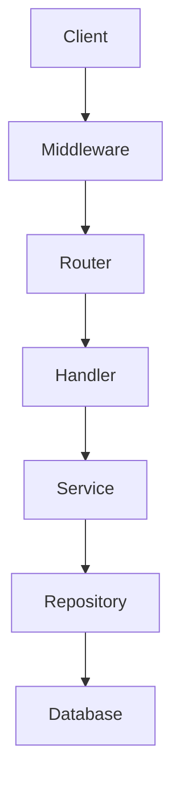
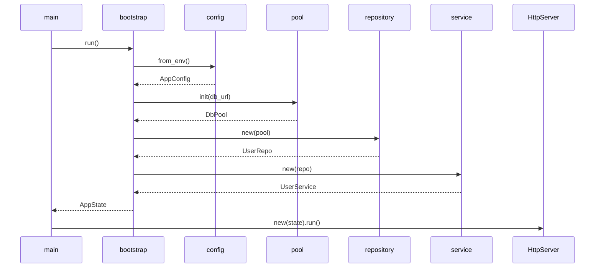

# Kiến trúc

## Mô hình

Modular Monolith. Một binary duy nhất, chia theo module nghiệp vụ.

## Các tầng

```
┌─────────────────────────────────────┐
│  Presentation                       │  HTTP entry
├─────────────────────────────────────┤
│  Domains                            │  Nghiệp vụ
├─────────────────────────────────────┤
│  Infrastructure                     │  Database, security
├─────────────────────────────────────┤
│  Bootstrap                          │  Khởi động
└─────────────────────────────────────┘
```

| Tầng | Chứa | Không chứa |
|---|---|---|
| Presentation | Handler, DTO | SQL, nghiệp vụ |
| Domains | Service, repository trait, entity | HTTP, Diesel |
| Infrastructure | Database, security | Nghiệp vụ, HTTP |
| Bootstrap | Config, pool, state | Business logic |

## Cấu trúc thư mục

```
src/
├── main.rs
├── lib.rs
├── routes.rs
│
├── bootstrap/
│   ├── config.rs
│   ├── pool.rs
│   ├── state.rs
│   └── mod.rs
│
├── presentation/
│   ├── dto/
│   ├── handlers/
│   ├── support/
│   └── mod.rs
│
├── domains/
│   ├── user/
│   │   ├── mod.rs
│   │   ├── repository.rs
│   │   └── service.rs
│   ├── post/
│   ├── comment/
│   ├── tag/
│   ├── report/
│   ├── role/
│   └── mod.rs
│
└── infrastructure/
    ├── database/
    │   ├── models/
    │   ├── repositories/
    │   ├── pool.rs
    │   ├── schema.rs
    │   └── mod.rs
    ├── security/
    │   ├── jwt.rs
    │   ├── extractor.rs
    │   ├── middleware.rs
    │   └── mod.rs
    └── mod.rs
```

## Luồng request



Chi tiết:

| Bước | Ai làm | Việc |
|---|---|---|
| 1 | Middleware | Verify JWT, gắn `AuthUser` |
| 2 | Router | So khớp path → handler |
| 3 | Handler | Parse DTO, gọi service |
| 4 | Service | Business logic, gọi repository |
| 5 | Repository | Query DB, map entity |
| 6 | Database | Thực thi SQL |

## Luồng khởi động



## Phân chia module

| Module | Aggregate | Repository |
|---|---|---|
| user | User | UserRepository |
| post | Post | PostRepository |
| comment | Comment | CommentRepository |
| tag | Tag | TagRepository |
| report | Report | ReportRepository |
| role | Role | Không có — dùng UserRepository |

