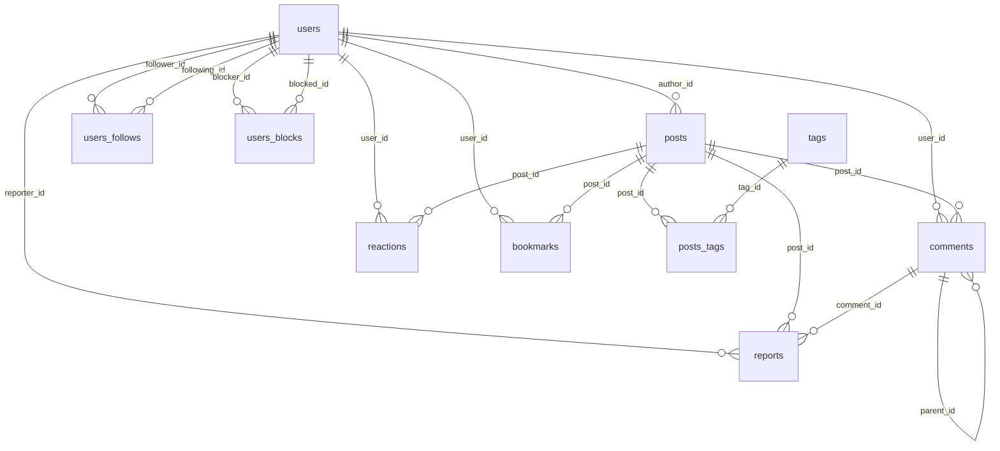

# Dữ liệu

PostgreSQL 15.

## Sơ đồ quan hệ

## Bảng

### Người dùng

| Bảng | Vai trò |
|---|---|
| users | Tài khoản (role + status) |
| users_follows | Quan hệ theo dõi |
| users_blocks | Quan hệ chặn |

### Nội dung

| Bảng | Vai trò |
|---|---|
| posts | Bài viết |
| tags | Nhãn |
| posts_tags | Gắn tag vào post |
| comments | Bình luận (có reply) |

### Tương tác

| Bảng | Vai trò |
|---|---|
| reactions | Reaction emoji |
| bookmarks | Lưu bài |
| reports | Báo cáo vi phạm |

## Cột

### users

| Cột | Kiểu | Ghi chú |
|---|---|---|
| id | BIGSERIAL | PK |
| username | TEXT | UNIQUE, NOT NULL |
| email | TEXT | UNIQUE, NOT NULL |
| password | TEXT | NOT NULL |
| avatar_url | TEXT | |
| bio | TEXT | |
| role | TEXT | `user` \| `moderator` \| `admin`, default `user` |
| status | TEXT | `active` \| `inactive` \| `banned`, default `active` |
| created_at | TIMESTAMPTZ | NOT NULL |
| updated_at | TIMESTAMPTZ | NOT NULL |
| muted_until | TIMESTAMPTZ | NULL = không mute |

### posts

| Cột | Kiểu | Ghi chú |
|---|---|---|
| id | BIGSERIAL | PK |
| author_id | BIGINT | FK users, NOT NULL |
| title | TEXT | NOT NULL |
| content | TEXT | |
| view_count | INTEGER | default 0 |
| status | TEXT | `draft` \| `published` \| `hidden`, default `draft` |
| comments_locked | BOOLEAN | default false |
| created_at | TIMESTAMPTZ | NOT NULL |
| updated_at | TIMESTAMPTZ | NOT NULL |

### comments

| Cột | Kiểu | Ghi chú |
|---|---|---|
| id | BIGSERIAL | PK |
| parent_id | BIGINT | FK comments, NULL = top-level |
| post_id | BIGINT | FK posts, NOT NULL |
| user_id | BIGINT | FK users, NOT NULL |
| content | TEXT | NOT NULL |
| status | TEXT | `visible` \| `hidden`, default `visible` |
| created_at | TIMESTAMPTZ | NOT NULL |
| updated_at | TIMESTAMPTZ | NOT NULL |

### tags

| Cột | Kiểu | Ghi chú |
|---|---|---|
| id | BIGSERIAL | PK |
| name | TEXT | UNIQUE, NOT NULL |
| description | TEXT | |
| created_at | TIMESTAMPTZ | NOT NULL |
| updated_at | TIMESTAMPTZ | NOT NULL |

### reports

| Cột | Kiểu | Ghi chú |
|---|---|---|
| id | BIGSERIAL | PK |
| reporter_id | BIGINT | FK users, NOT NULL |
| post_id | BIGINT | FK posts, NULL |
| comment_id | BIGINT | FK comments, NULL |
| reason | TEXT | NOT NULL |
| detail | TEXT | |
| status | TEXT | `pending` \| `reviewing` \| `resolved` \| `rejected`, default `pending` |
| created_at | TIMESTAMPTZ | NOT NULL |
| resolved_at | TIMESTAMPTZ | |

### Bảng nối

| Bảng | Cột | PK |
|---|---|---|
| users_follows | follower_id, following_id, followed_at | (follower_id, following_id) |
| users_blocks | blocker_id, blocked_id, blocked_at | (blocker_id, blocked_id) |
| posts_tags | post_id, tag_id | (post_id, tag_id) |
| reactions | user_id, post_id, emoji, reacted_at | (user_id, post_id) |
| bookmarks | user_id, post_id, bookmarked_at | (user_id, post_id) |

## Ràng buộc

### UNIQUE

- `users.username`, `users.email`, `tags.name`

### CHECK

- `users.role IN ('user','moderator','admin')`
- `users.status IN ('active','inactive','banned')`
- `posts.status IN ('draft','published','hidden')`
- `comments.status IN ('visible','hidden')`
- `reports.status IN ('pending','reviewing','resolved','rejected')`
- `users_follows.follower_id <> following_id`
- `users_blocks.blocker_id <> blocked_id`
- `reports`: đúng một trong `post_id` hoặc `comment_id` có giá trị

### FOREIGN KEY

- Hầu hết FK dùng `ON DELETE CASCADE`
- `comments.parent_id`: xoá cha → xoá con
