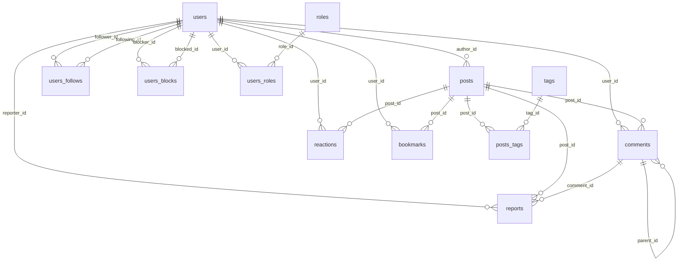

# Dữ liệu

PostgreSQL 15.

## Sơ đồ quan hệ

## Danh sách bảng

### Người dùng

| Bảng | Vai trò |
|---|---|
| users | Tài khoản |
| roles | Nhóm quyền |
| users_roles | Gán role cho user |
| users_follows | Quan hệ theo dõi |
| users_blocks | Quan hệ chặn |

### Nội dung

| Bảng | Vai trò |
|---|---|
| posts | Bài viết |
| tags | Nhãn |
| posts_tags | Gắn tag vào post |
| comments | Bình luận |

### Tương tác

| Bảng | Vai trò |
|---|---|
| reactions | Reaction emoji |
| bookmarks | Lưu bài |
| reports | Báo cáo vi phạm |

## Cột chính

### users

| Cột | Kiểu | Ràng buộc |
|---|---|---|
| id | BIGSERIAL | PK |
| username | TEXT | UNIQUE, NOT NULL |
| email | TEXT | UNIQUE, NOT NULL |
| password | TEXT | NOT NULL |
| avatar_url | TEXT | |
| bio | TEXT | |
| status | TEXT | active, inactive, banned, pending |
| created_at | TIMESTAMPTZ | NOT NULL |
| updated_at | TIMESTAMPTZ | NOT NULL |
| muted_until | TIMESTAMPTZ | |

### roles

| Cột | Kiểu | Ràng buộc |
|---|---|---|
| id | BIGSERIAL | PK |
| name | TEXT | UNIQUE, NOT NULL |
| description | TEXT | |
| created_at | TIMESTAMPTZ | NOT NULL |
| updated_at | TIMESTAMPTZ | NOT NULL |

### posts

| Cột | Kiểu | Ràng buộc |
|---|---|---|
| id | BIGSERIAL | PK |
| author_id | BIGINT | FK users, NOT NULL |
| title | TEXT | NOT NULL |
| content | TEXT | |
| view_count | INTEGER | NOT NULL, default 0 |
| status | TEXT | draft, published, hidden, deleted |
| comments_locked | BOOLEAN | NOT NULL, default false |
| created_at | TIMESTAMPTZ | NOT NULL |
| updated_at | TIMESTAMPTZ | NOT NULL |
| deleted_at | TIMESTAMPTZ | |

### comments

| Cột | Kiểu | Ràng buộc |
|---|---|---|
| id | BIGSERIAL | PK |
| parent_id | BIGINT | FK comments |
| post_id | BIGINT | FK posts, NOT NULL |
| user_id | BIGINT | FK users, NOT NULL |
| content | TEXT | NOT NULL |
| status | TEXT | visible, hidden, deleted |
| created_at | TIMESTAMPTZ | NOT NULL |
| updated_at | TIMESTAMPTZ | NOT NULL |

### tags

| Cột | Kiểu | Ràng buộc |
|---|---|---|
| id | BIGSERIAL | PK |
| name | TEXT | UNIQUE, NOT NULL |
| description | TEXT | |
| created_at | TIMESTAMPTZ | NOT NULL |
| updated_at | TIMESTAMPTZ | NOT NULL |

### reports

| Cột | Kiểu | Ràng buộc |
|---|---|---|
| id | BIGSERIAL | PK |
| reporter_id | BIGINT | FK users, NOT NULL |
| post_id | BIGINT | FK posts |
| comment_id | BIGINT | FK comments |
| reason | TEXT | NOT NULL |
| detail | TEXT | |
| status | TEXT | pending, reviewing, resolved, rejected |
| created_at | TIMESTAMPTZ | NOT NULL |
| resolved_at | TIMESTAMPTZ | |

## Bảng nối

| Bảng | Cột | PK |
|---|---|---|
| users_roles | user_id, role_id, assigned_at | (user_id, role_id) |
| users_follows | follower_id, following_id, followed_at | (follower_id, following_id) |
| users_blocks | blocker_id, blocked_id, blocked_at | (blocker_id, blocked_id) |
| posts_tags | post_id, tag_id | (post_id, tag_id) |
| reactions | user_id, post_id, emoji, reacted_at | (user_id, post_id) |
| bookmarks | user_id, post_id, bookmarked_at | (user_id, post_id) |

## Ràng buộc

### UNIQUE

- users.username
- users.email
- roles.name
- tags.name

### CHECK

- users_follows: `follower_id <> following_id`
- users_blocks: `blocker_id <> blocked_id`
- reports: đúng 1 trong 2 `post_id` hoặc `comment_id` có giá trị

### FOREIGN KEY

- ON DELETE CASCADE cho hầu hết FK
- posts_tags, reactions, bookmarks: xóa theo post hoặc user
- comments.parent_id: xóa cha → xóa con
