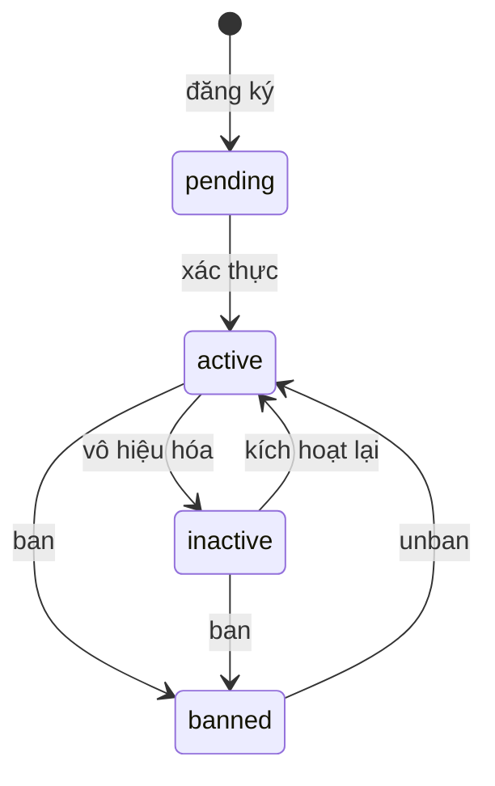
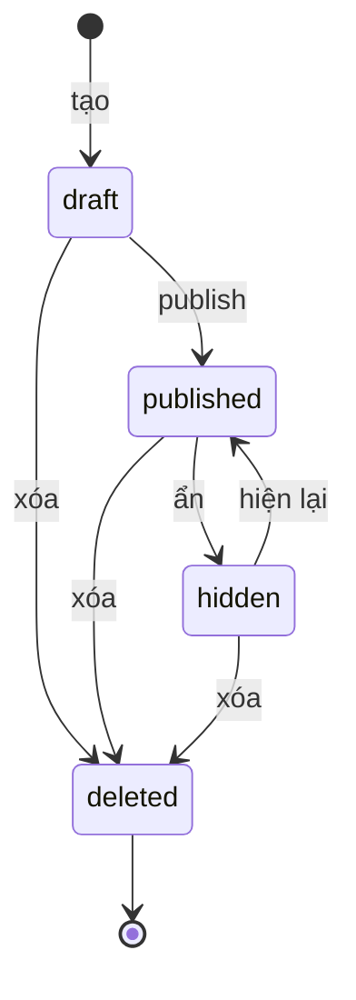
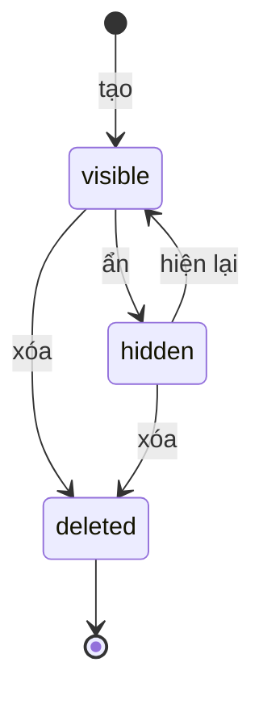
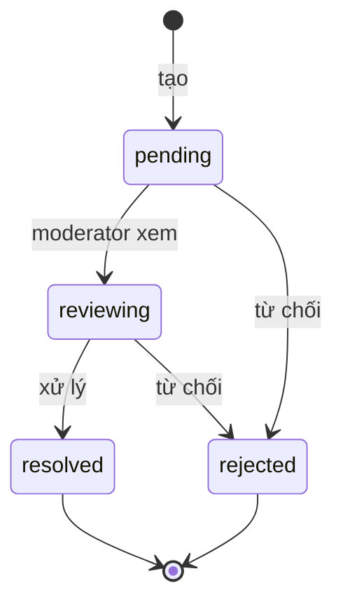
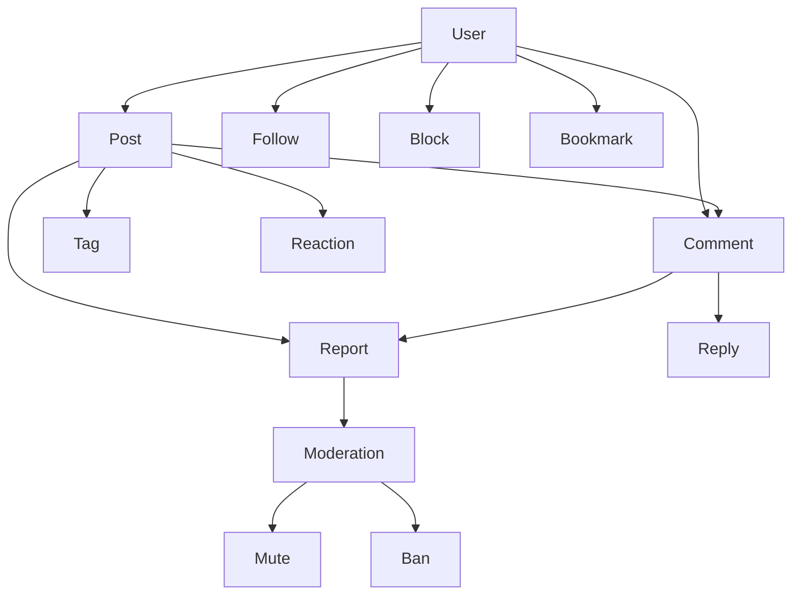

# Nghiệp vụ

## User

### Trạng thái

Giá trị: `active`, `inactive`, `banned`, `pending`.

### Quy tắc

- username, email duy nhất.
- Đăng ký tạo user với status `active`.
- Mute tạm thời: `muted_until > NOW()`.
- User bị banned không thể đăng nhập.
- User bị muted không thể tạo post hoặc comment.

### Hành vi

| Hành động | Mô tả |
|---|---|
| Đăng ký | Tạo user với status active |
| Đăng nhập | Verify password, trả JWT |
| Cập nhật | Sửa avatar, bio |
| Theo dõi | Thêm vào users_follows |
| Chặn | Thêm vào users_blocks |

## Role

### Giá trị

| Role | Quyền |
|---|---|
| user | Tạo post, comment, reaction |
| moderator | Xử lý report, mute, ban |
| admin | Toàn quyền |

Admin bao hàm Moderator. Moderator bao hàm User.

### Quy tắc

- Admin seed từ cấu hình khi khởi động.
- Moderator do admin gán.
- Không thể gỡ role admin qua API.
- Không thể gán role admin qua API.

## Post

### Trạng thái

Giá trị: `draft`, `published`, `hidden`, `deleted`.

### Quy tắc

- Tạo post mặc định ở draft.
- Chỉ publish từ draft.
- Không hide post đã deleted.
- Xóa mềm: `status = 'deleted'`, `deleted_at = NOW()`.
- `comments_locked` độc lập với `status`.

### Khóa bình luận

- Có thể khóa ở bất kỳ trạng thái nào trừ deleted.
- Post bị khóa không nhận comment mới.

### Hành vi

| Hành động | Ai làm |
|---|---|
| Tạo | Chủ post |
| Publish | Chủ post |
| Hide | Moderator |
| Xóa | Chủ post, Moderator |

## Comment

### Trạng thái

Giá trị: `visible`, `hidden`, `deleted`.

### Quy tắc

- Bình luận gốc: `parent_id` là NULL.
- Reply: `parent_id` trỏ tới comment cha.
- Reply phải cùng post với comment cha.
- Content không rỗng.
- Không bình luận khi post `comments_locked`.
- Xóa comment cha → xóa toàn bộ reply.

### Hành vi

| Hành động | Ai làm |
|---|---|
| Tạo | User |
| Reply | User |
| Hide | Moderator |
| Xóa | Chủ comment, Moderator |

## Tag

### Quy tắc

- Tên duy nhất.
- Chữ thường.
- Giới hạn số tag mỗi post.

## Reaction

### Quy tắc

- Mỗi user chỉ có 1 reaction cho mỗi post.
- Đổi emoji: cập nhật reaction hiện có.
- Emoji hợp lệ: 👍 ❤️ 😂 😮 😢 😡.

### Hành vi

| Hành động | Mô tả |
|---|---|
| React | Thêm hoặc cập nhật |
| Bỏ react | Xóa reaction |

## Bookmark

### Quy tắc

- Mỗi user chỉ bookmark 1 post 1 lần.
- Bookmark có thể bật/tắt.

### Hành vi

| Hành động | Mô tả |
|---|---|
| Lưu | Thêm vào bookmarks |
| Bỏ lưu | Xóa khỏi bookmarks |

## Report

### Trạng thái

Giá trị: `pending`, `reviewing`, `resolved`, `rejected`.

### Quy tắc

- Đúng 1 trong 2 `post_id` hoặc `comment_id` có giá trị.
- 1 user chỉ report 1 target 1 lần.
- Không report nội dung của chính mình.
- Chỉ moderator hoặc admin xử lý.
- Khi resolve: ẩn hoặc xóa nội dung bị report.

### Lý do report

| Giá trị | Nghĩa |
|---|---|
| spam | Quảng cáo, spam |
| harassment | Quấy rối |
| hate_speech | Ngôn từ thù địch |
| misinformation | Thông tin sai lệch |
| nsfw | Nội dung nhạy cảm |
| other | Khác |

## Quan hệ giữa các nghiệp vụ

## Soft delete

| Entity | Cách | Dọn dẹp |
|---|---|---|
| Post | status = deleted, deleted_at | Job định kỳ |
| Comment | status = deleted | Khi xóa post cha |
| User | status = banned | Không xóa |
| Report | Giữ nguyên | Không xóa |
